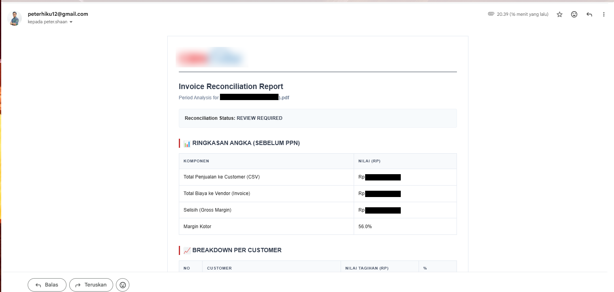
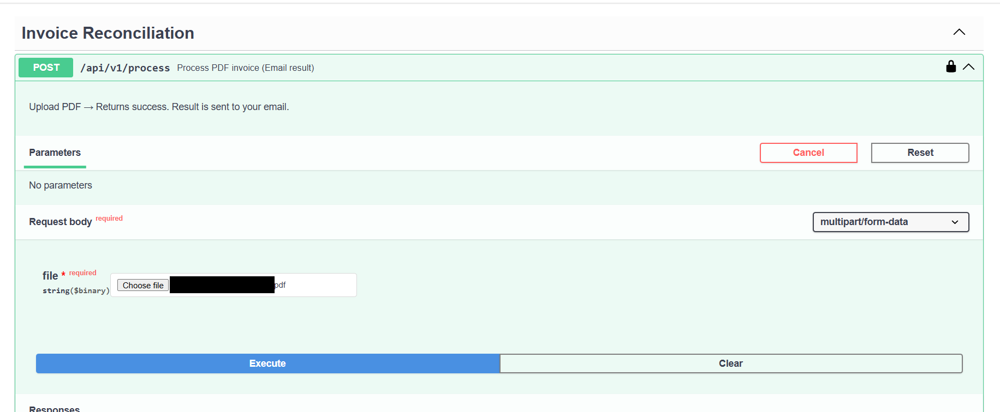

# ☁️ AI PDF Analyzer Invoice Engine

Ai Analyze adalah sistem rekonsiliasi invoice otomatis yang ditenagai oleh Kecerdasan Buatan. Sistem ini membandingkan data tagihan dari vendor (PDF) dengan data penjualan internal (Database) secara akurat dan cepat.

## 🌟 Fitur Utama

- **Smart PDF Parsing**: Ekstraksi metadata otomatis (Bulan, Tahun, Total) dari invoice PDF.
- **Deep Reconciliation**: Penyesuaian data tagihan vs data penjualan per customer dan per produk.
- **AI Financial Analysis**: Analisis risiko dan rekomendasi dari auditor AI (Qwen).
- **Graceful Guardrails**: Deteksi otomatis untuk dokumen non-invoice atau konten yang tidak sesuai.
- **Auto-Reports**: Laporan profesional dikirim langsung ke email beserta attachment CSV.

## 📸 Preview Laporan


_Tampilan analisis rekonsiliasi yang detail dan mudah dipahami._


_Laporan profesional yang dikirimkan langsung ke email user._

## 🚀 Quick Start

1. **Setup Environment**:

   ```bash
   cp config.example.yml config.yml
   # Update the config
   ```

2. **Run with Docker**:

   ```bash
   docker build -t ai-analyze
   docker run -p 8000:8000 ai-analyze
   ```

3. **API Access**:
   Upload invoice PDF ke endpoint `POST /api/v1/process`.

---

_Developed with ❤️ by Peter Shaan_
